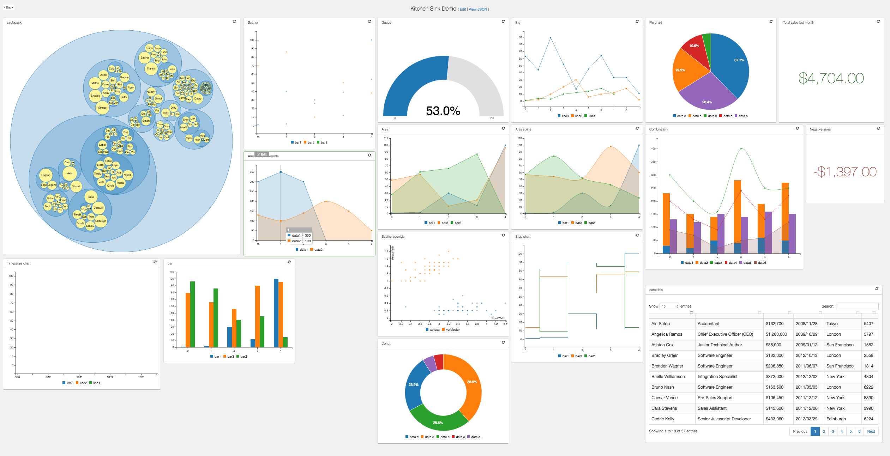
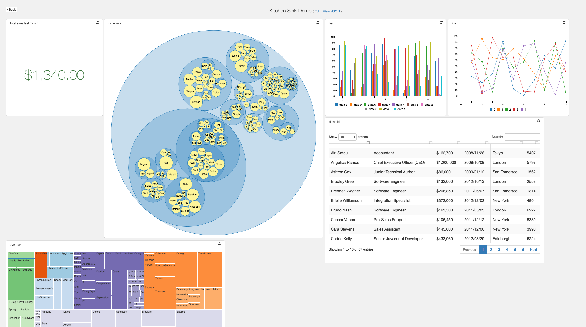

# Flask JSONDash

Easily configurable, chart dashboards from any arbitrary API endpoint. JSON config only. Ready to go.

This project is a [flask blueprint](http://flask.pocoo.org/docs/0.10/blueprints/) that allows you to create sleek dashboards without writing any front end code. It saves JSON configurations for declaring arbitrary charts, leveraging popular libraries like C3.js and D3.js. It also supports templates and iframes, as well as other data visualization libraries. The beauty is that it simply requires a very basic configuration and uses any arbitrary json endpoint to get data, so long as the [payload format is correct](schemas.md).

The dashboard layout and blueprint styles are pre-packaged, and provide only the essentials, while getting out of the way.

## Example configuration / demos

Each chart is very straightforward. Most of the power is leveraged by the various charting libraries. See [schemas](schemas.md) for more detail on how your endpoint json data should be formatted for a given chart.

If you want to see all/most charts in action, you'll need to fire up the `endpoints.py` flask app (included), and then in your database, insert a record, specifying one of the json files found in [examples/config](examples/config). (This has been tested using mongodb).

## Usage

### Requirements

### Core

* Flask
* Jinja2

### Javascript/CSS

These are not included, as you are likely going to have them yourself. If you don't, you'll need to add them:

* Jquery (JS)
* Bootstrap (CSS/JS)

These are necessary and included, based simply on the likelihood they may not alread be used:

* JRespond (JS)
* SugarJS (JS)
* Freewall (JS)

### Charts

Chart requirements depend on what you want to expose to your users. You can configure these in the CHARTS_CONFIG dictionary in the `settings.py` file. You can override these settings by adding your own file, called `settings_override.py`

### Setting environment variables.

Make sure the following env vars are set:

* *CHARTS_DB_HOST* - The DB server hostname (defaults to 'localhost')
* *CHARTS_DB_PORT* - The DB server port (defaults to 27017)
* *CHARTS_DB_NAME* - The DB database name (defaults to 'charts')
* *CHARTS_DB_TABLE* The DB collection name (or sql table name) (defaults to 'views')
* *CHARTS_ACTIVE_DB* The DB backend to use - options: 'mongo', 'postgres' (defaults to 'mongo')

### Starting DB

Make sure to start so json configuration can be saved.

#### Mongodb

Start however you'd like, but usually `mongod` will work.

#### Postgresql

Start however you'd like, but usually `postgres -D /path/to/data/` will work.

### Starting flask app

Either import and use the blueprint in your own flask app, or run `app.py` directly to start the app as-is.

### Starting the test server

Run `endpoints.py` if you'd like to test out existing endpoints to link your chart json to.

### Using remote AJAX endpoints

See `endpoints.py` for examples on how to achieve this. If you do not allow CORS on the server-side, all ajax requests will fail.

## FAQs

**Q**: "Why'd you choose to expose library X, Y, or Z?"

*A*: I tried to go for libraries that are pretty widely known and popular. If you are dissastisfied with what's exposed, you can always add your own by embeddding any js/css and html in a template, and loading it through the `iframe` option.

**Q**: "How do I customize X, Y, Z?"

*A*: Because of the level of abstract used here, a lot of charts will naturally be less configurable than if they had been scripted by hand. This is the tradeoff with being able to quickly setup a lot of charts easily.

The goal here is to use intelligent defaults as much as possible, and then allow the most universal aspects to be customized through a common interface.

In a future roadmap, I may try to allow for arbitrary customizations to be passed alongside the default configuration, on a per chart basis.

Keep in mind, many *stylistic* customizations can be overridden in css, since most all charts are html and/or SVG. And, as mentioned above, you can always use the iframe option and make your `dataSource` endpoint return whatever you want, including a full html/js/css pre-rendered template.

## Tips & tricks

### Using endpoints dynamically

Because the chart builder utilizes simple endpoints, you can use the power of REST to create more complicated views. For example:

`curl -XGET http://localhost:5002/api/foo/`

could return `{"data": [1, 2, 3, 4]}`, but you could customize the url by updating the url saved in your dashboard to support query arguments:

`curl -XGET http://localhost:5002/api/foo?gt=9`

could return {"data": [10, 20, 30, 40]} instead!
